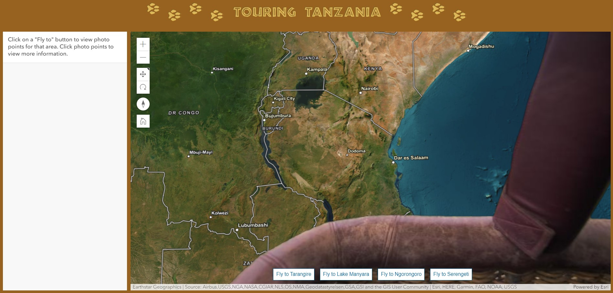

# Touring Tanzania 
  
  # Table of Content
- [Touring Tanzania ](#touring-tanzania-)
- [Table of Content](#table-of-content)
  - [Description:](#description)
  - [Installation:](#installation)
  - [License:](#license)
  - [Tests:](#tests)
  - [Preview:](#preview)
  - [Deployment](#deployment)
  - [Accreditations:](#accreditations)

## Description:
Touring Tanzania is an application that takes you on a hot air balloon safari through wildlife parks in Tanzania. Along the way you can view photos of the animals that inhabit the region and learn a fun fact about each one you encounter. The map and data this application was build around uses the ArcGIS API for JavaScript and the banner was designed with Figma.

## Installation:
You can clone the repository and open index.html in your browser or you can access Touring Tanzania live by clicking [here.](https://pacific-plains-13730-2a22247c3916.herokuapp.com/)

## License:
Copyright 2022, Stephen Novelli

Permission is hereby granted, free of charge, to any person obtaining a copy of this software and associated documentation files (the "Software"), to deal in the Software without restriction, including without limitation the rights to use, copy, modify, merge, publish, distribute, sublicense, and/or sell copies of the Software, and to permit persons to whom the Software is furnished to do so, subject to the following conditions:

The above copyright notice and this permission notice shall be included in all copies or substantial portions of the Software.

THE SOFTWARE IS PROVIDED "AS IS", WITHOUT WARRANTY OF ANY KIND, EXPRESS OR IMPLIED, INCLUDING BUT NOT LIMITED TO THE WARRANTIES OF MERCHANTABILITY, FITNESS FOR A PARTICULAR PURPOSE AND NONINFRINGEMENT. IN NO EVENT SHALL THE AUTHORS OR COPYRIGHT HOLDERS BE LIABLE FOR ANY CLAIM, DAMAGES OR OTHER LIABILITY, WHETHER IN AN ACTION OF CONTRACT, TORT OR OTHERWISE, ARISING FROM, OUT OF OR IN CONNECTION WITH THE SOFTWARE OR THE USE OR OTHER DEALINGS IN THE SOFTWARE.

[View License](https://www.mit.edu/~amini/LICENSE.md) 
       
## Tests:
No tests are currently required to run this application.
    
## Preview:

## Deployment

This app was deployed using the Heroku Buildpack for Node.js and can be seen live [here.](https://pacific-plains-13730-2a22247c3916.herokuapp.com/)

## Accreditations:
All images were taken by me personally and are under copyright. The facts that have been included are all paraphrased versions of many different sources and are not being claimed as my own research. Any of the content seen here is in no way to be used for monetization purposes. 
